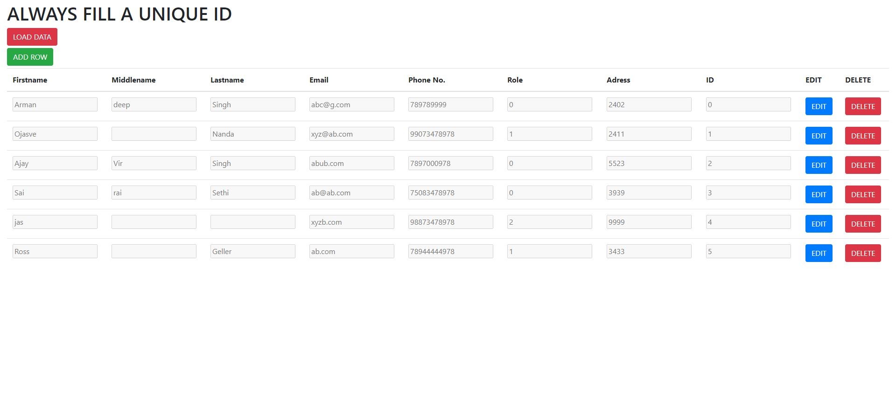

# EMPLOYEE DATABASE
This employee database application shows records of various employees.
You can perform ADD,DELETE,EDIT functions on it.
Postgres is used to store the data(locally).

# TECHNOLOGIES USED
HTML,CSS,Bootstrap,Typescript,Javascript,Postegresql

# SCREENSHOTS

